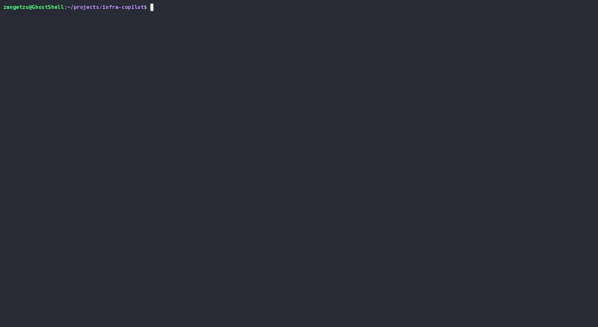

<div align="center">

# 🤖 Bashops-Agent 🤖

**Ask your infrastructure questions in plain text. Runs 100% locally on your GPU.**

**A ReAct-based LLM agent for infrastructure troubleshooting.**

**Runs kubectl, shell, and PromQL queries against real systems, reasons over the output, and responds in plain text, fully local via Ollama, no data leaves your network.**

        

[](https://github.com/lsalazarm-sec/bashops-agent/actions)
[](https://www.python.org/downloads/)
[](LICENSE)
[](https://ollama.com)
[](https://rocm.docs.amd.com)

[Demo](#-demo) · [Why this exists](#-why-this-exists) · [Features](#-features) · [Quickstart](#-quickstart) · [Architecture](#-architecture) · [Safety](#-safety-model) · [Docs](#-documentation)

</div>

---

## Demo

### CLI [+] One-Shot Queries [+]


> Ask a question, get an answer. The agent runs `kubectl` and shell commands under the hood,
> reasons about the real output, and responds in plain English.

### TUI [+] Interactive Session [+]


> The interactive mode lets you have a back-and-forth conversation with your infrastructure.
> Each question builds on the context of the session. Press `Ctrl+C` to exit.

> The agent runs `kubectl` and `df` under the hood, reasons about the output, and responds in plain text.
> No copy-pasting commands, no tab switching.

### Prometheus [+] Metrics and monitoring queries [+]




> The agent queries Prometheus directly via PromQL to check target health and resource metrics.
> Note: in local `kind` clusters, control-plane components (etcd, kube-scheduler, kube-proxy)
> often show as "down" in Prometheus because they don't expose metrics endpoints by default —
> this is a kind limitation, not an actual cluster issue.


> Recent 60-minute trends to identify sudden spikes or drops.
> Automated log summary for the immediate trailing hour.


### Wazuh Security Alerts [+] Reconnaissance & Authentication Spikes [+]


> The agent queries the Wazuh API to catch real-time infrastructure threats, mapping behavior, and network exposure loops.
> Recent 60-minute trends highlight active Kali Linux port scans (`netstat`) and unauthorized brute-force attempts targeting the pod.


## Security & Threat Detection Demos

### 1. Kali Linux Reconnaissance & Hydra Attack
Execution of port scanning and SSH brute-force attack vectors targeting the environment using Nmap and Hydra from Kali Linux.


### 2. Wazuh SIEM Overview & Incident Analysis
A guided tour of the Wazuh Dashboard showing active agents, security events, severity classification, and real-time alert generation resulting from the simulated attack.


### 3. Local LLM Security Query (`bashops ask`)
Interacting with the local LLM agent to analyze the SIEM state and extract structured security tables by querying: `"what are the most critical recent security alerts in wazuh?"`.


---

## Why this exists

Debugging infrastructure means context-switching between 8 terminal tabs before you even start reasoning about what went wrong — `kubectl`, `journalctl`, `top`, `ss`, logs, events, all at once.

`bashops-agent` is a local LLM agent that does the data gathering for you. You ask a question in plain English, it runs the right commands against your real infrastructure, reads the output, and explains what it found.

**No data leaves your network.** The LLM runs entirely on your GPU via [Ollama](https://ollama.com). No API keys, no subscriptions, no usage costs.

Built and tested on an AMD Radeon RX 7700 XT with ROCm 7.x on Ubuntu 24.04.

---

## Features

-  **Local LLM inference** — Qwen 2.5 Coder 14B running on your GPU via Ollama. Swap models with one config change.
-  **Real tool execution** — the agent actually runs `kubectl`, `journalctl`, `df`, `ps`, `ss`, and more. Not a wrapper around `kubectl explain`.
-  **Safety-first design** — read-only by default. Strict command allowlist. No shell string interpolation. Every action is audited.
-  **JSONL audit log** — every command, its arguments, output size, and latency logged to `~/.local/share/bashops-agent/audit.jsonl`.
-  **TUI + CLI** — interactive Textual UI for conversations, one-shot CLI for scripting.
-  **ReAct reasoning loop** — the agent iterates: decide → execute tool → reason about output → decide again, until it has a complete answer.
-  **Linux-first, AMD-ready** — built on Ubuntu 24.04 with ROCm 7.x. Works with NVIDIA and CPU too.
-  **Prometheus integration** — query metrics and monitor cluster health via PromQL
-  **Grafana dashboards** — production-grade Kubernetes and Prometheus dashboards included out of the box
-  **Wazuh integration** — query connected security agents and recent alerts via natural language
---

## Quickstart

### Prerequisites

- Linux (Ubuntu 24.04 recommended)
- Python 3.12+
- [Ollama](https://ollama.com) installed and running
- `kubectl` configured with at least one cluster (local or remote)

### Install

```bash
# Pull the model (one-time, ~9GB)
ollama pull qwen2.5-coder:14b

# Clone and install
git clone https://github.com/lsalazarm-sec/bashops-agent.git
cd bashops-agent
uv sync

# Initialize config
bashops init
```

### One-shot query

```bash
# Kubernetes
uv run bashops ask "why is the api-gateway pod restarting?"
uv run bashops ask "which nodes have the most memory pressure?"
uv run bashops ask "what pods are running in the default namespace?"

# System
uv run bashops ask "how much disk space is left on this machine?"
uv run bashops ask "what's using the most CPU right now?"

# Prometheus
uv run bashops ask "is everything up according to prometheus?"
uv run bashops ask "what's the available memory according to prometheus?"
uv run bashops ask "show me the CPU usage trend for the last hour"

```

### Interactive TUI

```bash
uv run bashops tui
```

### Available commands

```
bashops ask <question>     One-shot query
bashops tui                Interactive TUI session
bashops init               Create default config file
bashops version            Print version

```
---

##  Architecture


The agent uses a **ReAct (Reason + Act) loop**, it reasons about what information it needs, calls a tool, gets real output, and reasons again. 
This means answers are always grounded in actual system state, not hallucinated.

See [docs/architecture.md](docs/architecture.md) for full design decisions and trade-offs.

---

##  Safety model

Security is a first-class concern. The agent cannot do anything you haven't explicitly permitted.

| Guardrail | Default | Override |
|---|---|---|
| Read-only mode | ✅ ON | `--write` flag (not yet implemented) |
| kubectl allowed verbs | `get`, `describe`, `logs`, `top`, `explain`, `version` | `~/.config/bashops-agent/config.yaml` |
| Shell allowed binaries | `journalctl`, `systemctl`, `ps`, `ss`, `df`, `free`, `uptime`, `ip` | `config.yaml` |
| No shell string interpolation | Always | Not overridable |
| Audit log | Always on | `config.yaml` |

> **Note:** This is not a substitute for proper RBAC.
>           Use a least-privilege kubeconfig.
>           The copilot inherits whatever permissions your kubectl context has.

---

##  Configuration

Default config is created at `~/.config/bashops-agent/config.yaml` by running `bashops init`:

```yaml
llm:
  provider: ollama
  base_url: http://localhost:11434
  model: qwen2.5-coder:14b
  temperature: 0.1
  timeout_seconds: 120

safety:
  read_only: true
  require_confirmation: true
  audit_log: true
  kubectl_allowed_verbs:
    - get
    - describe
    - logs
    - top
    - explain
    - version
  shell_allowed_cmds:
    - journalctl
    - systemctl
    - ps
    - ss
    - df
    - free
    - uptime
    - ip
```

---

## 🖥️ AMD GPU setup (ROCm)

Built and tested on:
- **GPU:** AMD Radeon RX 7700 XT (gfx1101, 12GB VRAM)
- **ROCm:** 7.2.3
- **OS:** Ubuntu 24.04.4 LTS
- **Ollama:** 0.24.0 with native ROCm support

See [docs/rocm-setup.md](docs/rocm-setup.md) for the full setup guide from scratch.

---

## 🗺️ Roadmap

### v0.1 — Core agent (current)
- [x] ReAct agent with kubectl and shell tools
- [x] JSONL audit log
- [x] CLI (one-shot queries)
- [x] TUI (interactive sessions)
- [x] Safety allowlist
- [x] Adaptive response format

### v0.2 — Observability
- [x] Prometheus / PromQL tool
- [x] Grafana dashboards (Cluster, Namespace, Prometheus health, API server SLOs)
- [ ] Node metrics and resource pressure detection
- [ ] Multi-cluster context switching

### v0.3 — Security integrations
- [x] Wazuh API tool — query alerts, agents, and security events (deployment automated via Ansible)
- [ ] SSH executor (opt-in per host)
- [ ] Alert correlation across kubectl + Wazuh

### v0.4 — Polish
- [ ] RAG over runbooks and postmortems
- [ ] Session export to Markdown
- [ ] Write mode with confirmation prompt
- [ ] Plugin system for custom tools

---

## 📖 Documentation

- [Architecture](docs/architecture.md)
- [ROCm setup guide](docs/rocm-setup.md)
- [Adding a custom tool](docs/custom-tools.md)
- [Configuration reference](docs/configuration.md)
- [Grafana Dashboards](docs/grafana-dashboards.md)
---

## 🛠️ Development

```bash
git clone https://github.com/lsalazarm-sec/bashops-agent.git
cd bashops-agent
uv sync --all-extras --dev

# Run tests
uv run pytest -v

# Lint
uv run ruff check .
uv run ruff format .
```

---

## 🤝 Contributing

PRs welcome. See [CONTRIBUTING.md](CONTRIBUTING.md) for guidelines.

---

## 📄 License

MIT © [Luis Salazar](https://github.com/lsalazarm-sec)
