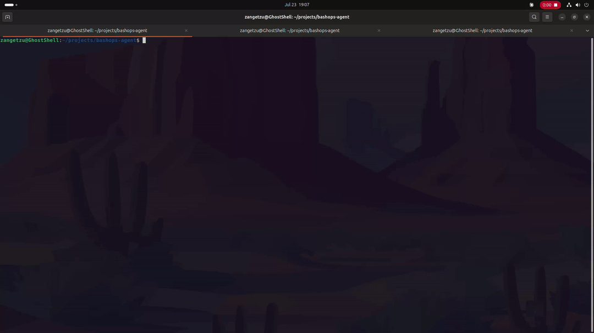
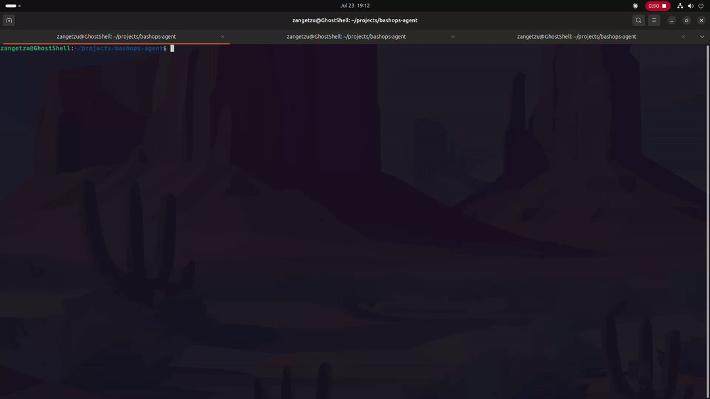
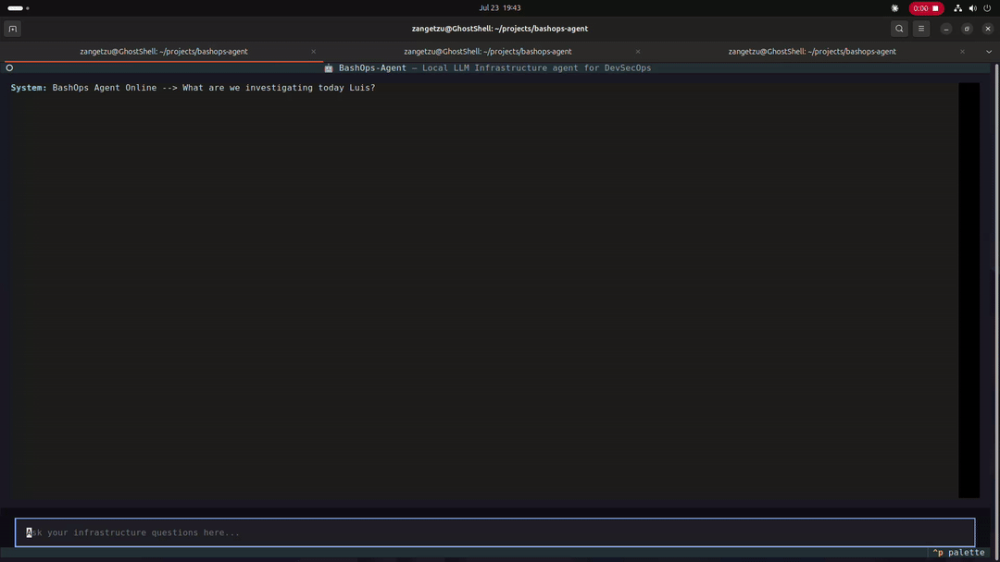
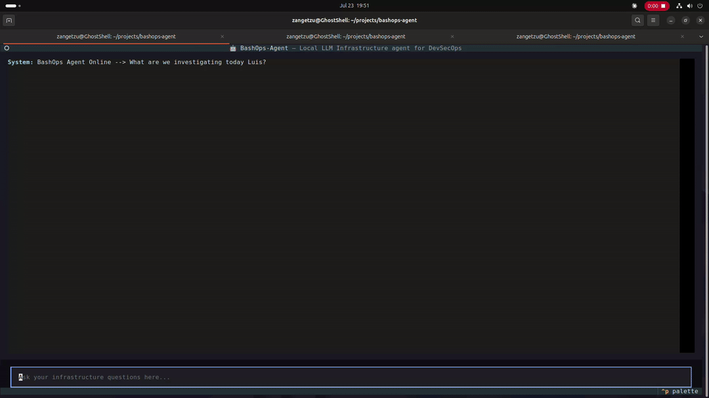
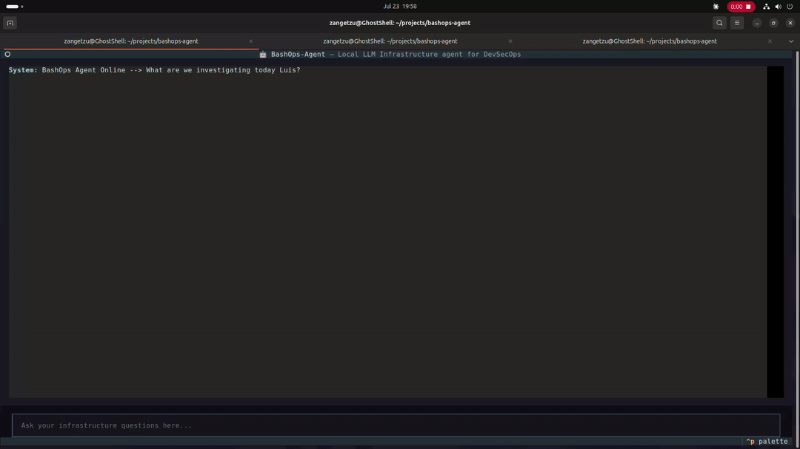
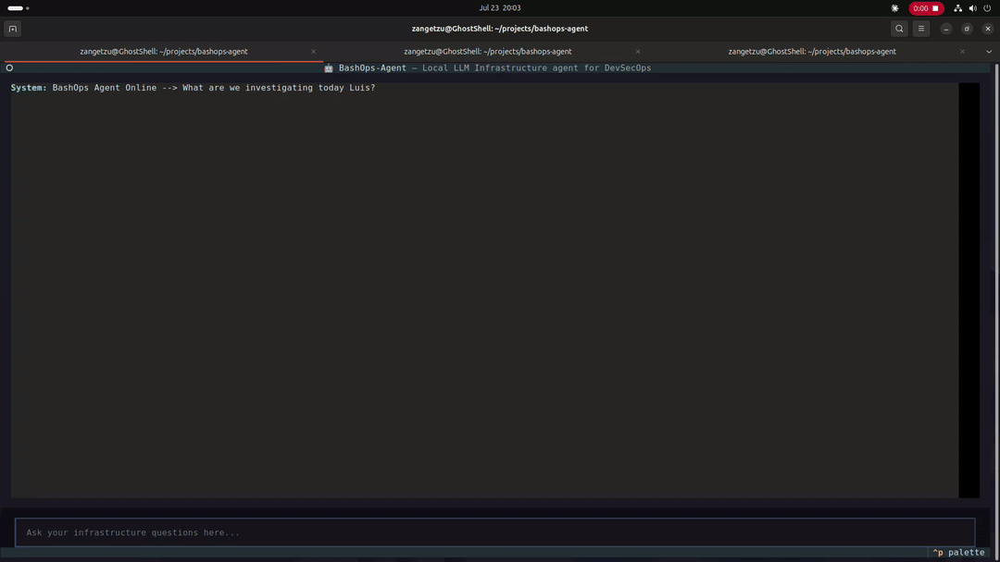
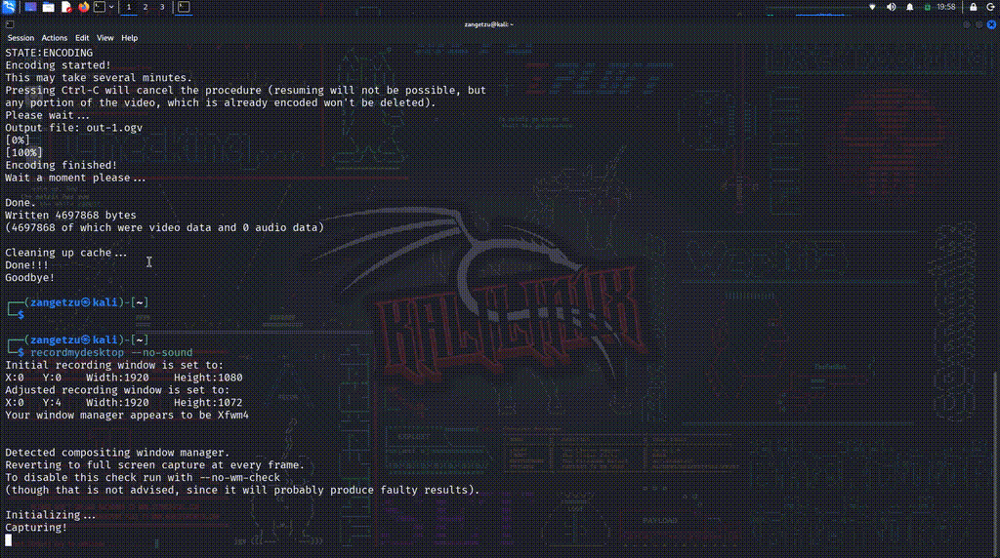
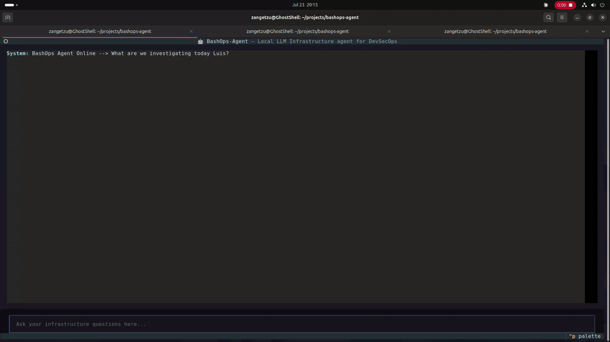

<div align="center">

# 🤖 Bashops-Agent 🤖

**Ask your infrastructure questions in plain text. Runs 100% locally on your GPU.**

**A ReAct-based LLM agent for infrastructure troubleshooting.**

**Runs kubectl, shell, and PromQL queries against real systems, reasons over the output, and responds in plain text, fully local via Ollama, no data leaves your network.**

        

[](https://github.com/lsalazarm-sec/bashops-agent/actions)
[](https://dev.azure.com/lsalazarm-sec/BashOps-Agent/_build/latest?definitionId=2&branchName=main)
[](https://www.python.org/downloads/)
[](LICENSE)
[](https://ollama.com)
[](https://rocm.docs.amd.com)

[Demo](#-demo--capabilities) · [Security Demos](#-security--threat-detection-demos) · [Why this exists](#-why-this-exists) · [Features](#-features) · [Quickstart](#-quickstart) · [Architecture](#-architecture) · [Safety](#-safety-model) · [Docs](#-documentation)

</div>

---

##  Demo & Capabilities

### Command-Line Operations (CLI) & Safety Executions

The CLI mode is designed for quick, single-shot queries and immediate incident response.

#### 1. Passive Diagnostics (Read-Only)
For standard diagnostics, the agent operates with standard privileges, safely querying system states without the risk of accidental modifications.


> **Action:** Querying system uptime and disk space utilization using `df` and `uptime`.

#### 2. Authorized Remediations (Mutative Actions)
When a prompt requires changing the system state, the agent enforces a strict **Human-In-The-Loop (HITL)** barrier. 
*Note: To execute mutative shell commands, the CLI must be invoked with root privileges preserving the environment (`sudo -E`), as standard OS security prevents unprivileged users from altering firewall or service configurations.*


> **Action:** The agent proposes a `ufw` block rule against a malicious IP, provides a mandatory engineering rationale, waits for `Y/N` authorization from the administrator, and executes the remediation.

---

###  Interactive Terminal Interface (TUI)

The TUI provides a persistent conversational context for complex debugging sessions, allowing you to have a back-and-forth conversation with your infrastructure.

#### 1. System & Container Operations
The agent can chain multiple commands, analyzing process trees and container states in a single cohesive response.

**System RAM & Process Analysis:**
> **Prompt:** `What is eating my RAM?`



**Docker Health Check:**
> **Prompt:** `Is the docker service healthy?`



#### 2. Kubernetes (K8s) Orchestration
Seamlessly interacts with your clusters, fetching pod states, logs, and events to diagnose deployment issues.


> **Action:** Auditing a specific namespace for crash loops, checking pod status, and reading logs to find the root cause of a failure.

#### 3. Observability (Prometheus & Grafana)
Instead of overwhelming the LLM with raw UNIX timestamps, BashOps Agent intercepts PromQL matrix responses, calculates statistical summaries, and feeds a clean payload to the LLM.


> **Action:** Analyzing CPU usage trends over a 30-minute window and checking target health status.

---

##  Security & Threat Detection Demos

### 1. Kali Linux Reconnaissance & Hydra Attack
Execution of port scanning and SSH brute-force attack vectors targeting the environment using Nmap and Hydra from Kali Linux.



### 2. Wazuh SIEM Overview & Incident Analysis
A guided tour of the Wazuh Dashboard showing active agents, security events, severity classification, and real-time alert generation resulting from the simulated attack.


### 3. Local LLM Security Query (`bashops ask`)
Interacting with the local LLM agent to analyze the SIEM state and extract structured security tables by querying: `"What are the most critical recent security alerts in wazuh?"`.



---

##  Why this exists

Debugging infrastructure means context-switching between 8 terminal tabs before you even start reasoning about what went wrong — `kubectl`, `journalctl`, `top`, `ss`, logs, events, all at once.

`bashops-agent` is a local LLM agent that does the data gathering for you. You ask a question in plain English, it runs the right commands against your real infrastructure, reads the output, and explains what it found.

**No data leaves your network.** The LLM runs entirely on your GPU via [Ollama](https://ollama.com). No API keys, no subscriptions, no usage costs.

Built and tested on an AMD Radeon RX 7700 XT with ROCm 7.x on Ubuntu 24.04.

---

##  Features

- **Local LLM inference** — Qwen 2.5 Coder 14B running on your GPU via Ollama. Swap models with one config change.
- **Real tool execution** — the agent actually runs `kubectl`, `journalctl`, `df`, `ps`, `ss`, and more. Not a wrapper around `kubectl explain`.
- **Safety-first design** — Strict command allowlist. No shell string interpolation. Every action is audited.
- **JSONL audit log** — every command, its arguments, output size, and latency logged to `~/.local/share/bashops-agent/audit.jsonl`.
- **TUI + CLI** — interactive Textual UI for conversations, one-shot CLI for scripting.
- **ReAct reasoning loop** — the agent iterates: decide → execute tool → reason about output → decide again, until it has a complete answer.
- **Linux-first, AMD-ready** — built on Ubuntu 24.04 with ROCm 7.x. Works with NVIDIA and CPU too.
- **Prometheus integration** — query metrics and monitor cluster health via PromQL.
- **Grafana dashboards** — production-grade Kubernetes and Prometheus dashboards included out of the box.
- **Wazuh integration** — query connected security agents and recent alerts via natural language.

---

##  Quickstart

### Prerequisites

- Linux (Ubuntu 24.04 recommended)
- Python 3.12+
- [uv](https://github.com/astral-sh/uv) installed
- [Ollama](https://ollama.com) installed and running
- `kubectl` configured with at least one cluster (local or remote)

### Install

```bash
# Pull the model (one-time, ~9GB)
ollama pull qwen2.5-coder:14b

# Clone and install
git clone [https://github.com/lsalazarm-sec/bashops-agent.git](https://github.com/lsalazarm-sec/bashops-agent.git)
cd bashops-agent
uv sync

# Initialize config
bashops init
```

### One-shot query (Examples)

```bash
# System & Docker
uv run bashops ask "What is eating my RAM right now?"
uv run bashops ask "Is the docker service healthy?"

# Kubernetes
uv run bashops ask "Are there any pods continuously restarting in the default namespace?"

# Observability & Security
uv run bashops ask "Are all prometheus targets currently up?"
uv run bashops ask "What are the most critical recent security alerts in wazuh?"
```

📚 **Looking for more?** Check out the full [BashOps Prompt Cheatsheet](docs/cheatsheet.md) for advanced use cases across Kubernetes, Prometheus, Wazuh, and system administration.

---

##  Architecture


The agent uses a **ReAct (Reason + Act) loop**, it reasons about what information it needs, calls a tool, gets real output, and reasons again. 
This means answers are always grounded in actual system state, not hallucinated.

See [docs/architecture.md](docs/architecture.md) for full design decisions and trade-offs.

---

##  Safety model

Security is a first-class concern. The agent cannot do anything you haven't explicitly permitted.

| Guardrail | Enforcement | Description |
|---|---|---|
| **Read-Only Mode** | Configurable | Toggle to completely disable mutative operations. |
| **Human-In-The-Loop** | Configurable | Administrator must input `Y/N` before any mutative execution. |
| **Rationale Required** | Configurable | Forces the LLM to provide a strict engineering explanation before altering the system. |
| **Allowed Binaries** | Explicit List | Restricts shell execution strictly to predefined commands (e.g., `journalctl`, `df`). |
| **Mutative Binaries** | Explicit List | Specifies which binaries can alter state (e.g., `ufw`, `systemctl`). |
| **Audit Log** | Always On | Complete logging of all tool inputs, outputs, and latencies. |

> **Note:** This is not a substitute for proper RBAC.
> Use a least-privilege kubeconfig.
> The copilot inherits whatever permissions your kubectl context has.

---

##  Configuration

Default config is created at `~/.config/bashops-agent/config.yaml` by running `bashops init`:

```yaml
llm:
  provider: ollama
  base_url: http://localhost:11434
  model: qwen2.5-coder:14b
  temperature: 0.1
  timeout_seconds: 120

safety:
  read_only: false
  require_confirmation: true
  audit_log: true
  rationale_required: true 
  
  kubectl_allowed_verbs:
    - get
    - describe
    - logs
    - top
    - explain
    - version
  
  shell_allowed_cmds:
    - journalctl
    - systemctl status
    - ps
    - ss
    - df
    - free
    - uptime
    - ip
  
  shell_mutative_cmds:
    - systemctl restart
    - systemctl stop
    - ufw
    - iptables
    - kill
```

---

##  AMD GPU setup (ROCm)

Built and tested on:
- **GPU:** AMD Radeon RX 7700 XT (gfx1101, 12GB VRAM)
- **ROCm:** 7.2.3
- **OS:** Ubuntu 24.04.4 LTS
- **Ollama:** 0.24.0 with native ROCm support

See [docs/rocm-setup.md](docs/rocm-setup.md) for the full setup guide from scratch.

---

##  Roadmap

### v0.1 — Core agent (current)
- [x] ReAct agent with kubectl and shell tools
- [x] JSONL audit log
- [x] CLI (one-shot queries)
- [x] TUI (interactive sessions)
- [x] Safety allowlist
- [x] Adaptive response format

### v0.2 — Observability
- [x] Prometheus / PromQL tool
- [x] Grafana dashboards (Cluster, Namespace, Prometheus health, API server SLOs)
- [ ] Node metrics and resource pressure detection
- [ ] Multi-cluster context switching

### v0.3 — Security integrations
- [x] Wazuh API tool — query alerts, agents, and security events (deployment automated via Ansible)
- [ ] SSH executor (opt-in per host)
- [ ] Alert correlation across kubectl + Wazuh

### v0.4 — Polish
- [ ] RAG over runbooks and postmortems
- [ ] Session export to Markdown
- [ ] Write mode with confirmation prompt
- [ ] Plugin system for custom tools

---

##  Documentation

- [Architecture](docs/architecture.md)
- [ROCm setup guide](docs/rocm-setup.md)
- [Adding a custom tool](docs/custom-tools.md)
- [Configuration reference](docs/configuration.md)
- [Grafana Dashboards](docs/grafana-dashboards.md)

---

## 🛠️ Development

```bash
git clone [https://github.com/lsalazarm-sec/bashops-agent.git](https://github.com/lsalazarm-sec/bashops-agent.git)
cd bashops-agent
uv sync --all-extras --dev

# Run tests
uv run pytest -v

# Lint
uv run ruff check .
uv run ruff format .
```

---

## 🤝 Contributing

PRs welcome. See [CONTRIBUTING.md](CONTRIBUTING.md) for guidelines.

---

## 📄 License

MIT © [Luis Salazar](https://github.com/lsalazarm-sec)
