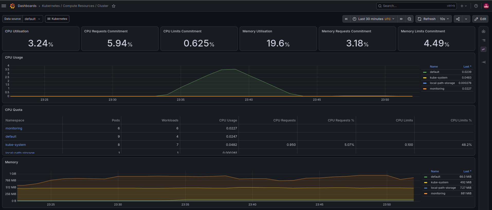
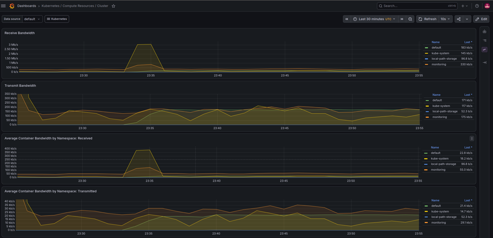
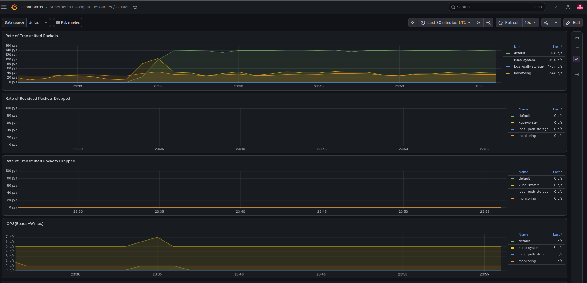
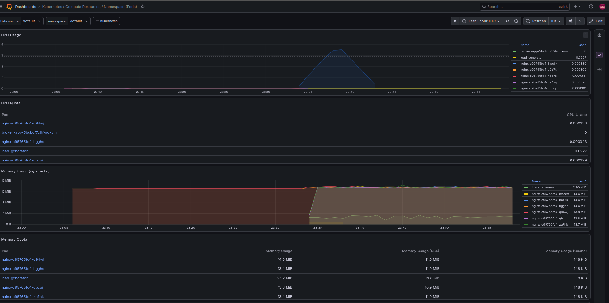
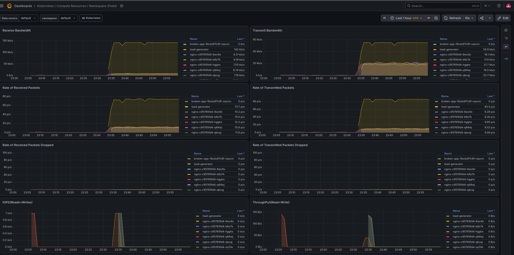
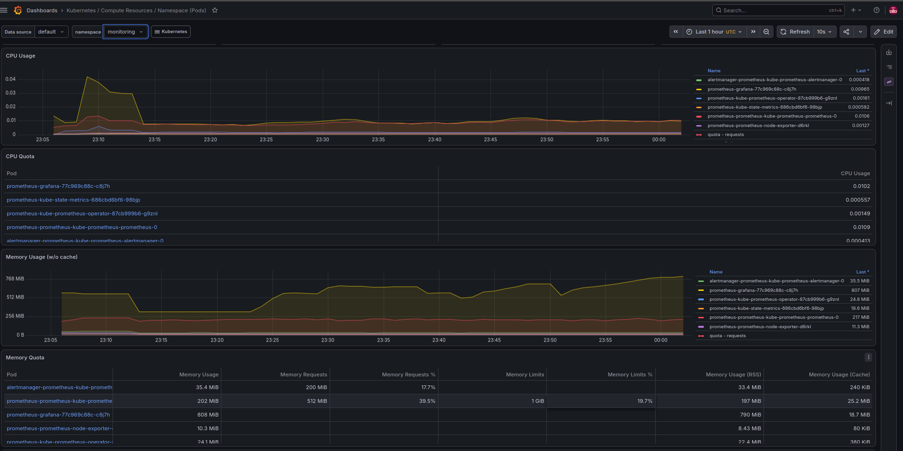
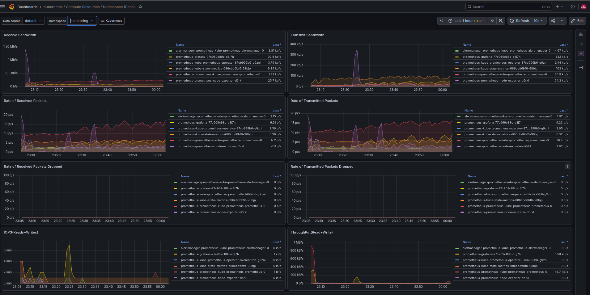
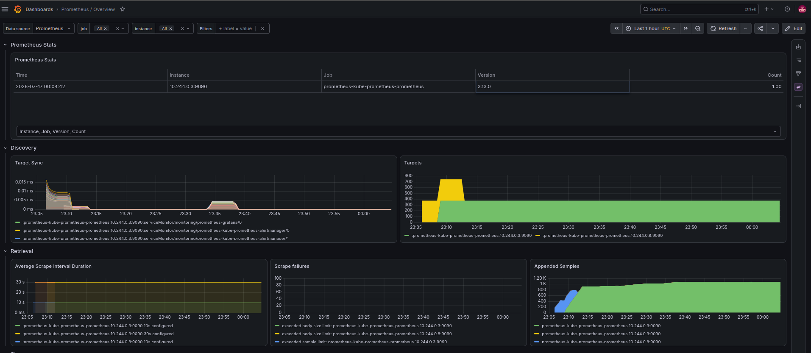
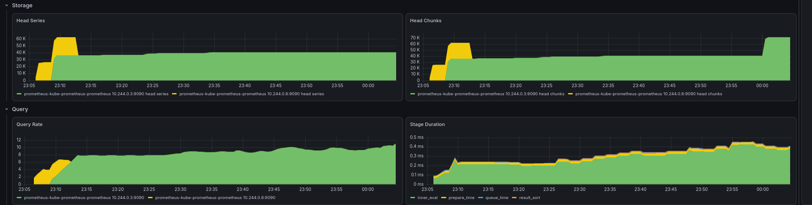
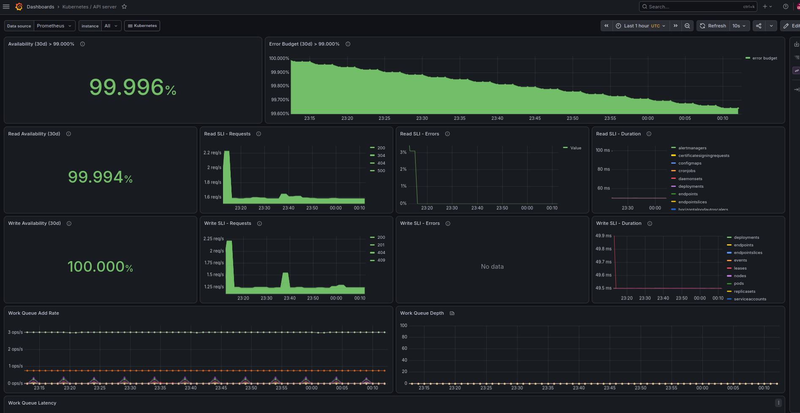

# Grafana Dashboards

`bashops-agent` deploys the `kube-prometheus-stack` Helm chart, which includes
Prometheus, Grafana, and Alertmanager preconfigured with production-grade Kubernetes
dashboards. These are the same dashboards an SRE would use in a real cluster.

## Cluster Compute Resources

Cluster-wide CPU, memory, network, and disk I/O broken down by namespace.


*CPU/memory utilisation and quota across all namespaces during a synthetic stress test.*


*Receive/transmit bandwidth per namespace, generated by a load-testing pod hitting nginx.*


*Packet rate and disk IOPS across the cluster.*

## Namespace: default

Workload-level metrics for the `default` namespace, where the test pods
(`nginx`, `broken-app`, `load-generator`) run.


*Per-pod CPU and memory usage — the spike corresponds to a `stress --cpu 4` test pod.*


*Per-pod network activity, driven by the `load-generator` pod hitting the nginx service.*

## Namespace: monitoring

The monitoring stack observing itself — Prometheus, Grafana, Alertmanager, and
the Prometheus Operator.


*Resource usage of the observability stack components.*


*Network activity between Prometheus, Grafana, and the Alertmanager.*

## Prometheus Overview

Internal Prometheus health — target discovery, scrape success rate, and storage.


*Active targets, scrape interval, and appended samples over time.*


*TSDB head series/chunks and query rate — confirms Prometheus is storing and serving data correctly.*

## Kubernetes API Server Health

SLO-style dashboard tracking API server availability and error budget over 30 days.


*99.996% availability with read/write SLI breakdowns — the same view used to track
API server health in production clusters.*

## Accessing Grafana locally

```bash
kubectl port-forward -n monitoring svc/prometheus-grafana 3000:80
```

Then open `http://localhost:3000`. Default credentials:
- Username: `admin`
- Password: retrieve with:
```bash
  kubectl get secret -n monitoring prometheus-grafana -o jsonpath="{.data.admin-password}" | base64 -d
```

## Note on control-plane metrics in kind

In local `kind` clusters, some control-plane components (`etcd`, `kube-scheduler`,
`kube-proxy`) do not expose Prometheus metrics endpoints by default, and may show as
"down" in target lists. This is a `kind` limitation, not a real cluster health issue —
in a managed Kubernetes service (EKS, AKS, GKE) or a properly configured on-prem
cluster, these targets are reachable.
